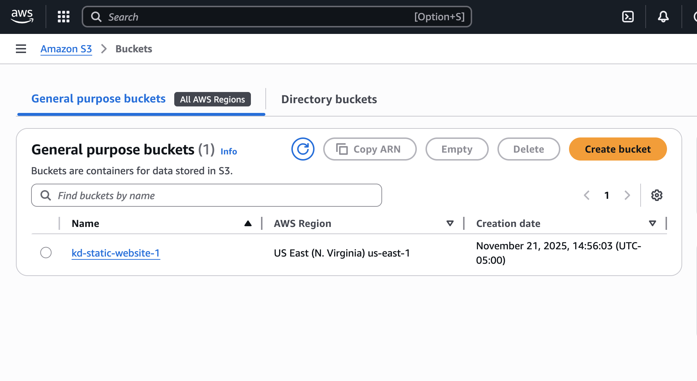
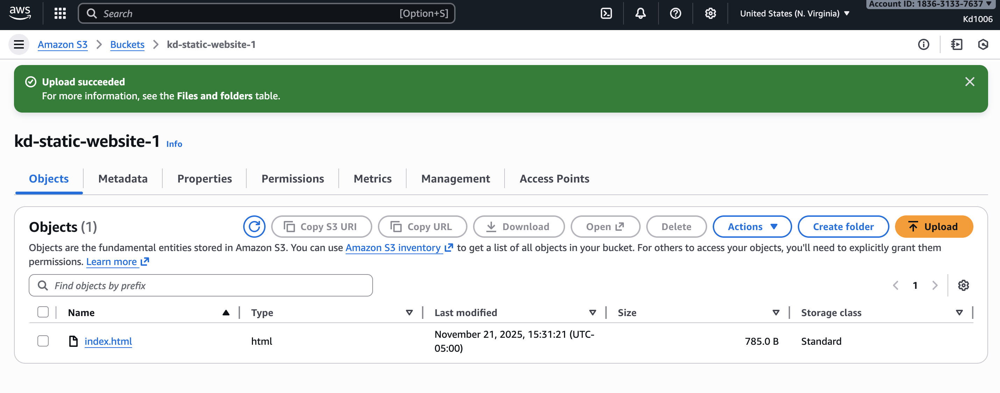
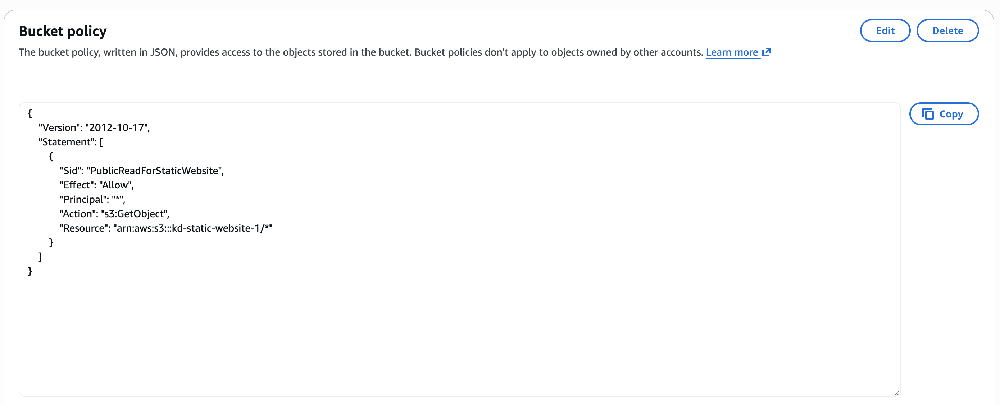
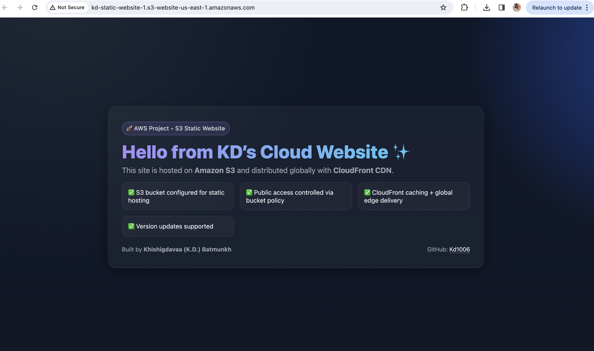
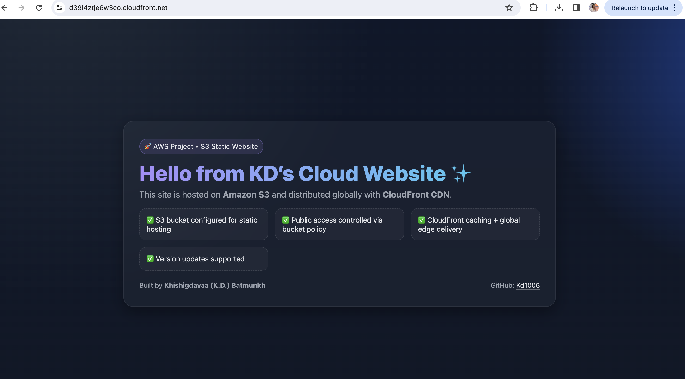

# aws-s3-static-website-cloudfront
Deploying a static website to Amazon S3 and distributing it globally with Amazon CloudFront. Includes hosting, bucket policies, error handling, invalidations, and version updates.
# aws-s3-static-website-cloudfront

Deploying a static website to Amazon S3 and distributing it globally with Amazon CloudFront.  
This project covers S3 static hosting, bucket policies, CloudFront distribution, caching, and CDN delivery.

---

## Architecture (High Level)

User → **CloudFront CDN** → **S3 Static Website Bucket** → `index.html`

CloudFront caches the site at edge locations so users load the page faster worldwide.

---

## What I Built

1. Created an S3 bucket configured for static website hosting.
2. Uploaded a custom `index.html`.
3. Enabled public read access through a bucket policy.
4. Verified site works using the S3 website endpoint.
5. Created a CloudFront distribution pointing to the S3 website.
6. Verified site works through the CloudFront domain.

---

## Steps

### 1. Create S3 Bucket
- Service: **S3**
- Bucket name: `kd-static-website-1`
- Region: `us-east-1 (Ohio)`
- Block Public Access: **Off**
- Bucket Versioning: Optional (I left it off to keep cost simple)

### 2. Upload Website File
- Uploaded `index.html` into the bucket.
- Confirmed file is publicly readable after policy is added.

### 3. Enable Static Website Hosting
- S3 → Bucket → **Properties**
- Static website hosting → **Enable**
- Index document: `index.html`
- Copied the **Bucket website endpoint**.

### 4. Add Bucket Policy (Public Read)
Allowed public access to website objects.

### 5. Confirm S3 Website Works
Visited the S3 website endpoint and confirmed the page loads.

### 6. Create CloudFront Distribution
- Service: **CloudFront**
- Origin: **S3 website endpoint**
- Default root object: `index.html`
- Left WAF/security on defaults (free tier).
- Created distribution.

### 7. Confirm CloudFront Website Works
Opened the CloudFront domain and confirmed the website loads globally.

---

## Screenshots

### S3 Setup

### CloudFront Setup

---

## Cleanup (to avoid charges)

1. CloudFront → Disable distribution → wait until status is Disabled → Delete.
2. S3 → Delete all objects.
3. S3 → Delete bucket.

---
Built by **Khishigdavaa (K.D.) Batmunkh**  
GitHub: **Kd1006**
